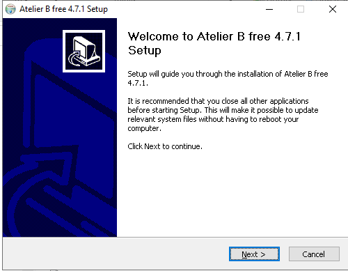
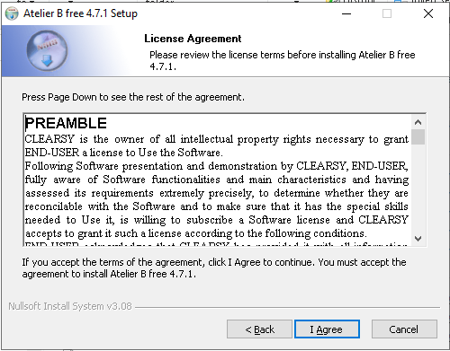
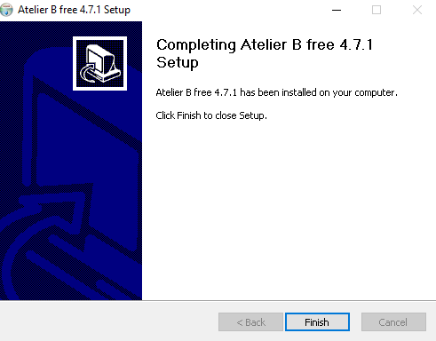

---
title: "Atelier B"
subtitle: "Installation Guide"
date: "Atelier B 4.7.1 Community Edition"
version: "Atelier B 4.7.1 Community Edition"
copyright: "© 2023 by CLEARSY"
licence: |
  Licensed under Attribution-NonCommercial-ShareAlike 4.0 International. To view a copy of this license, visit \url{http://creativecommons.org/licenses/by-nc-sa/4.0/}.
licence-logo: "images/by-nc-sa.png"
doccode: "ATB-IG-CE-4.7.1"
colorlinks: true
header-includes:
- |
  ```{=latex}
  \usepackage{awesomebox}
  \usepackage[utf8]{inputenc}
  \usepackage[french]{babel}
  ```
pandoc-latex-environment:
  importantblock: [requirement]
  noteblock: [note]

...
# Introduction

This guide provides installation instructions for Atelier B 4.7.1 Community Edition,
available from [www.atelierb.eu](https://www.atelierb.eu/en/atelier-b-support-maintenance/download-atelier-b/).


Atelier B and bbatch are integrated development environements (IDE) for the B method and Event-B.
Atelier B provides a graphical user interface (GUI) and bbatch is a command-line interface (CLI).

This guide provides installation guidelines for Atelier B and bbatch.

There is one chapter for each supported platform: [Linux](#linux-installation-guide), [macOS](#macos-installation-guide)
and [Windows](#windows-installation-guide).
Projects and workspaces are a source of confusion for new users, a [chapter](#projects-and-workspaces) is dedicated to them.
Finally a [lexicon](#lexicon) is provided to help the reader to understand the terminology used in this guide.

# Linux Installation Guide

## Installation of the Linux Debian 64 bits package

These instructions correspond to a successful install in a Linux Mint 21 Vanessa environment (base Ubuntu 22.04) and assume that
the package "atelierb-free-4.7.1p1-linux_x64.deb" has been downloaded.

Open a terminal and issue the following command:

```bash
sudo dpkg -i atelierb-free-4.7.1p1-linux_x64.deb
```

Enter the password to gain root access. The software is installed in the following directory:

```bash
/opt/atelierb-free-4.7.1p1
```

To open Atelier B GUI, issue the following command:

```bash
/opt/atelierb-free-4.7.1p1/startAB
```
Atelier B is now open

[](images/debian-fresh-install-gui.png)

To open bbatch CLI, issue the following command:

```bash
/opt/atelierb-free-4.7.1p1/startBB
```

## Installation of the Linux Universal package

These instructions correspond to a successful install in a Linux Mint 21 Vanessa environment (base Ubuntu 22.04) and assume that
the package "atelierb-free-4.7.1p1-linux_x64.tar.gz" has been downloaded.

Issue the following command to unpack the archive:

```bash
tar xf atelierb-free-4.7.1p1-linux_x64.tar.gz
```

This creates a directory named "atelierb-free-4.7.1p1-linux_x64opt/atelierb-free-4.7.1p1" in the current directory.

You may move this directory to a location of your choice, say "$HOME/local/AB-4.7.1".

To open Atelier B GUI, issue the following command:

```bash
$HOME/local/AB-4.7.1/startAB
```
Atelier B is now open

[](images/debian-fresh-install-gui.png)

To open bbatch CLI, issue the following command:

```bash
$HOME/local/AB-4.7.1/startBB
```

# macOS Installation Guide

:::note
The bbatch CLI is not available on macOS for this version of the software.
:::

These instructions correspond to a successful install in a macOS 14.0 (Sonoma) environment. They should be applicable to other versions of macOS.

Control-click on the installer file to start the installation process (double-clicking will not work as the publisher is not
white-listed in this environment). 

[](images/macos-installer.png)

This displays the license agreement dialog.

[](images/macos-installer-license-agreement.png)

Read carefully and click on "Agree" to proceed.

A finder window is opened, it contains a shortcut to the application folder and the Atelier B icon. 

[](images/macos-installer-finder.png)

Drag the Atelier B icon to drop it into the "Applications" folder.

Et voilà! Atelier B is now installed in the "Applications" folder.

[](images/macos-installer-applications.png)

The first time Atelier B is opened, use the control click combo, as otherwise macOS will deny the execution right to the application. macOS warns you that it does not know the software developer. Click on "Open" to proceed.

[](images/macos-installer-warning.png)

Atelier B is now open.

[](images/macos-fresh-install-gui.png)

# Windows Installation Guide

These instructions correspond to a successful install in a Windows 10 environment. They should be applicable to other versions of Windows.

Double-click on the installer file to start the installation process.

[](images/windows-installer.png)

Windows warns you that it does not know the software publisher. Click on "Yes" to proceed.

[](images/windows-installer-warning.png)

This opens the installer setup dialog.

[](images/windows-installer-setup.png)

Click on "Next" to proceed. The license agreement dialog is displayed.

[](images/windows-installer-license-agreement.png)

Click on "I Agree" to proceed (otherwise do not use the software). The installation folder dialog is displayed.

[](images/windows-installer-choose-location.png)

Choose a directory with full access rights (in this setup, we stick with the default location). Click on "Next" to proceed. The startup menu folder dialog is displayed.

[](images/windows-installer-choose-startup.png)

You may safely leave the default value. Click on "Install" to proceed. A progress
dialog appears. When the installation is finished, the following dialog is displayed.

[](images/windows-installer-finished.png)

Click on "Finish": installation is complete and the software is ready to use.
The startup menu folder now contains two entries for Atelier B: one for the GUI and one for the CLI.

[](images/windows-startup-menu.png)

If you double-click on the "Atelier B 4.7.1" entry, the GUI is started.

[](images/windows-fresh-install-gui.png)

If you double-click on the "Atelier B Batch interface (4.7.1)" entry, the CLI is started.

[](images/windows-fresh-install-gui.png)

You may encounter errors due to access controls on the directories that the tools need
to access. If this is the case, read through carefully the chapter on [projects and workspaces](#projects-and-workspaces).

# Projects and Workspaces

::: note
When you install and use Atelier B and bbatch, you must be make sure to have read/write access to worskpace(s)
and project(s) directories.
:::

In both Atelier B and bbatch, developments are organized in so-called **B projects**.
Each B project has a data base directory (bdp) and a language directory (lang).

* The data base directory (bdp) contains all the internal artifacts necessary for Atelier B and bbatch to work.

* The language directory (lang) contains the files in a programming language, such as C,
that are produced from the B components of the project. 

The B project is made up of a number of source files.
Source files are either B / Event-B components. 
The list of the source files of a B project is stored in the bdp in an XML file with the extension `db`.

For each B component, there is a corresponding PMM file with the same name and the extension `pmm`,
containing proof rules and proof tactics for this component. The PMM file shall be stored in the same directory
as the corresponding source file.

::: note
It is good practice to store the source files of a B project in a single directory.
:::

Atelier B lets the user have several **workspaces**, each workspace being a collection of projects.
In practice, a workspace is associated to a project data base directory (bdb), where each file ending with the
`desc` extension corresponds to a project. Actually, the contents of the `desc` file is only the
path to the bdp and lang directories of the project.

bbatch does not have the concept of workspace. It is the user's responsibility to provide the path to the
bdb of some workspace.

# Troubleshooting

A fresh install creates an empty workspace named "local" and associates it with a
directory (bdb) located in the user's home directory.

To know what is the bdb of a workspace, right-click on the workspace in Atelier B
and select "Properties". This opens the workspace properties dialog.

[](images/workspace-properties-bbatch.png)

The dialog has four tabs, and initially presented with the "bbatch" tab. There,
the following information is displayed:

- the name of the workspace (in this case, "local"),
- the path of the installation of Atelier B,
- the path to the bdb of the workspace (namely, the workspace database directory),
- a checkbox to indicate whether the workspace is the default workspace.

It is currently not possible to change the path to the bdb of a workspace from the GUI.
You may change the path to the bdb of a workspace by editing directly the settings of the tool. 

- On Linux: The settings are stored in the .config directory as plain text files and may be edited with any text editor.

- On macOS: The settings are stored in file "~/Library/Preferences/com.clearsy.AtelierB free 4.7.1.plist" and may be edited with the Xcode application.

- On Windows: the settings are stored in the registry and may be viewed and edited with RegEdit.
If you cannot change the path to the bdb of a workspace, you may create a new workspace
(menu "Atelier B | New | Workspace").

# Lexicon

##### bdb

See [Workspace](#workspace).

##### bdp

The **bdp** of a project is a directory that stores all the internal files necessary for the management of the project.

##### lang

The **bdp** of a project is a directory that stores all the files resulting from the translation to a programming
language of B components.

##### pmm

A file containing proof rules and proof tactics for a B component.

##### project

A **project** is a collection of B components and PMM files. It is referenced from a workspace thanks to a `desc` file.
It contains a data base directory (bdp) and a language directory (lang).

##### workspace

A **workspace** is a collection of projects. It is a directory containing a collection of `desc` files. Atelier B stores
the workspaces in its settings (in registry on Windows, under the $HOME/.config directory on Linux and macOS).
